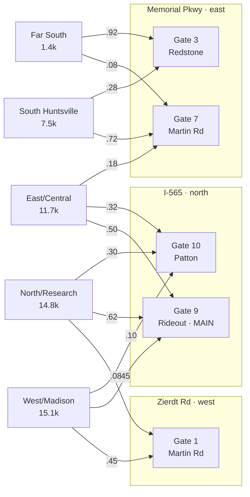

# Gate Traffic Simulation — Design Spec

> Status: **living draft**. Mark this up freely — open questions are tracked in §13.
> Last updated: 2026-06-25

## 1. Goal

Simulate vehicle traffic flowing through the controlled-access gates of Redstone
Arsenal (Huntsville, AL) in order to **optimize guard allocation** and let
different stakeholders play out scenarios (volume changes, gate hours, staffing).

The model is a **hybrid**:
- a **graph** for the road network and gate choice/rerouting, and
- a **queueing / discrete-event simulation** for what happens at each gate, wrapped by
- an **optimizer** that searches guard allocations against a selectable objective.

## 2. Modeling approach

Agent-based **discrete-event simulation (DES)**. Individual vehicles are agents that
spawn at origin zones, route to a gate, queue for a lane, get serviced, and pass through.
Gates are sets of parallel single-server lanes (not a pooled M/M/c — see §7).

## 3. Architecture & build order

The simulation engine talks to the road network only through a fixed **interface** (§4),
so the network can be swapped without touching the engine. Three tiers, built in order:

- **Tier 0 — no graph.** Each gate is an independent queue with its own arrival stream.
  Exists to validate queue + guard-allocation mechanics in isolation. *Build first.*
- **Tier 1 — schematic graph.** Directional origin zones → 3 arteries → access roads → 5 gates,
  with ring-adjacency rerouting and travel times. *Primary working version.*
- **Tier 2 — real network.** Import Huntsville roads from OpenStreetMap (`osmnx`) for real
  travel times and detour costs. Swap-in only; same interface.

## 4. Road network interface (the contract)

Every tier implements:

```
spawn_points()                  -> list of origin zones (where vehicles enter)
gates()                         -> list of gate nodes
route(origin, gate)             -> ordered list of edges (a path)
travel_time(edge, current_load) -> seconds (congestion-aware optional)
reachable_gates(origin)         -> gates this origin would realistically consider
```

## 5. Geography

- **Arteries (boundaries):** Memorial Parkway (E), I-565 (N), Zierdt Rd (W). South = river, not modeled.
- **5 gates** (physical lane counts; mock volume shares to start):

  | ID | Name / Road | Side | Lanes | Notes |
  |----|-------------|------|-------|-------|
  | Gate 1 | Martin Rd West | West | 3 | west load, no same-side sibling |
  | Gate 3 | Redstone Rd | SE (east) | 3 | lightest volume of all |
  | Gate 7 | Martin Rd East | East-central | 3 | |
  | Gate 9 | Rideout Rd | North | 7 | **main gate**, heaviest volume |
  | Gate 10 | Patton Rd | North (east end) | 3 | |
- **Substitutability = a ring, not clusters.** Rerouting follows perimeter adjacency
  (west ↔ north ↔ east). A west-origin driver may divert to an adjacent (north) gate but
  **never** crosses to the east side.

## 6. Arrival process

Non-homogeneous Poisson process with a time-varying rate **λ(t)** per gate.

- **Daily shape:** broad AM ramp 0715–0845, sharp peak 0730–0815, smaller midday bump.
- **Total volume:** ~50,000 vehicles/day (user-adjustable).
- **Per-gate split:** rough counts per gate (user-adjustable shares).
- All of {total volume, per-gate share, curve shape & peak times} are **user inputs**.

## 7. Service process

Each open lane is an **independent single server** (so one slow vehicle blocks only its lane).

- **Regular lanes:** tight base service-time distribution + low-probability heavy tail from
  **random searches** (multi-minute).
- **Commercial lane (one per gate):** a normal lane that **also serves regular traffic**, but
  commercial vehicles (delivery/construction) are **restricted to it**. Their extended service
  times therefore degrade that one lane only — regular vehicles in it share the pain, other
  lanes are unaffected.

## 8. Routing & rerouting

- Each vehicle has a **habit gate** determined by its origin zone.
- With some probability it "checks real-time" (Google Maps behavior) and may switch to a
  better **ring-adjacent, reachable** gate. Mostly habit, small reactive component.

## 9. Resource / shift / staffing model

- **One guard per open lane.**
- **Operating hours:** gates open **0530**. Each gate closes at **1330** or **2100**
  (per-gate **user input**).
  - Shift 1: 0530–1330.
  - Shift 2 (only for 2100 gates): 1300–2100, with a **1300–1330 overlap** (extra midday hands).
- **Budget = guard-shifts.** One unit = one guard staffing one lane for one shift.
  Total daily budget = **N** guard-shifts (user input). Keeping a gate open to 2100 spends a
  second-shift unit, making the hours-vs-staffing tradeoff explicit.
  - *Working assumption — confirm in §13.*
- **Decision variable:** assignment of guard-shifts to (gate, shift) lane slots, ≤ N total.
  Constant within a shift.

## 10. Run modes

- **Scenario mode (simulator):** user sets volume + staffing + gate hours → metric panel out.
  The stakeholder sandbox. *Build first.*
- **Optimizer mode:** hold N fixed, search guard-shift allocations to optimize a **selected**
  objective. Wraps the simulator.

## 11. Metrics panel & objectives

Computed every run; optimizer picks which to target:

- Average wait per vehicle
- p95 / max wait
- Throughput (vehicles/hour, per gate and total)
- **Delayed** count (vehicles whose *wait* exceeded a threshold, default 15 min — configurable)
- Peak / time-resolved queue length per gate
- Guard utilization

Objective is a **pluggable input**, not hardcoded — different stakeholders optimize different metrics.

## 12. User-adjustable inputs (schema sketch)

- Total daily volume; per-gate volume share; arrival-curve shape & peak windows
- Per-gate lane count; per-gate closing time (1330 / 2100)
- N (total guard-shift budget); allocation (or let optimizer choose)
- Commercial-vehicle fraction; random-search probability; service-time parameters
- Reroute probability; objective selection

## 13. Resolved decisions & remaining gaps

**Resolved:**
1. Guard budget = daily **guard-shift** pool. ✓
2. Commercial lane is open to regular traffic too; commercial vehicles restricted to it (see §7). ✓
3. Shift-change times adjustable later; current assumption stands. ✓
4. Lane counts known (see §5). **Volume figures are mock for now** — real per-gate counts to be
   provided later as adjustable inputs.

**Remaining / deferred:**
- Exact real per-gate volume splits (using mock shares until provided).
- Shift-varying staffing within a day: Tier 0 uses a single open window per gate at constant
  staffing; intra-day shift structure (§9) lands in Tier 1+.
- Lunch outbound traffic ignored at the queue for Tier 1 (un-gated); only returnees as inbound bump.

## 14. Proposed implementation stack

- **Python** + **SimPy** (process-based DES) for the engine.
- **networkx** for the Tier 1 graph; **osmnx** for Tier 2.
- Config-driven inputs (YAML/JSON) so scenarios are data, not code.
- *Proposed — open to alternatives.*

## 15. Outputs & visualization

**Implemented (Tier 0):**
- CSV dumps per run (`outputs/`): `vehicles.csv`, `gate_summary.csv`, `timeofday.csv`,
  `queue_by_time.csv`.
- Static charts (matplotlib, optional): arrival profile, average-wait-by-time,
  per-gate summary bars, and a **queue-length-over-time heatmap** (gate × time-of-day).

**Future enhancements (deferred):**
- **Interactive dashboard** (Streamlit or Plotly Dash): live sliders for volume / staffing /
  gate hours that re-run the sim and update charts. Most valuable *after* the optimizer and
  rerouting exist, so there is something meaty to drive. This becomes the primary stakeholder tool.
- **Map-based geographic view**: plot gates, queues, and approach routes on a Huntsville map.
  Mostly a Tier 2 payoff (needs real geography / OSM).
- *Possible heatmap refinement:* normalize queue **per lane** so cross-gate severity compares
  fairly (a small absolute queue at a 3-lane gate can be worse than a larger one at the 7-lane gate).

## 16. Tier 1: demand & road-network model

### 16.1 Layered topology

Gates sit on **access roads that cross the arteries**, not on the arteries themselves, so a
vehicle's path is three hops:

```
origin zone --> artery --> [junction: access road meets artery] --> access road --> gate
```

| Gate | Access road | Artery (junction) |
|------|-------------|-------------------|
| Gate 1 | Martin Rd | Zierdt (west) |
| Gate 9 | Rideout Rd | I-565 (north) |
| Gate 10 | Patton Rd | I-565 (north) |
| Gate 7 | Martin Rd | Memorial Pkwy (east) |
| Gate 3 | Redstone Rd | Memorial Pkwy (east) |

The **junction** is where the reroute decision physically happens (continue along the artery to
the next gate, or turn off here). *Note:* Martin Rd spans the installation (Gate 1 at its west
end on Zierdt, Gate 7 at its east end on Memorial) — an internal corridor we flag but do not
model in Tier 1.

### 16.2 Reroute adjacency = an open chain (river breaks the ring)

Because the south is a river, gates form an **open chain**, not a closed ring. Rerouting is only
between chain neighbors:

```
Gate 1 -- Gate 9 -- Gate 10 -- Gate 7 -- Gate 3
 (W)       (N-W)     (N-E)      (E-N)     (E-S)
```

Gate 1 can only spill to Gate 9; Gate 3 only to Gate 7; the chain never wraps Gate 3 -> Gate 1.

### 16.3 Origin zones & inflows (locked)

Inflows back-solved from the trusted per-gate totals via regularized reconciliation
(`tools/estimate_inflows.py`, lam=0.1; we trust gate totals over equal-zone priors). The data
forces West & North to be the largest zones, because 80% of all entries (G1+G9+G10 = 40k of
50.5k) occur at the three north/west gates, which only West/North/East can feed.

| Zone | Daily inflow |
|------|--------------|
| West/Madison | 15,100 |
| North/Research | 14,800 |
| East/Central | 11,700 |
| South Huntsville | 7,500 |
| Far South | 1,400 |

### 16.4 Habit OD split matrix (zone -> gate)

Baseline (no-congestion) gate choice. Rerouting perturbs this toward chain-adjacent gates when a
habit gate is congested. Rows sum to 1.

| Zone | G1 | G9 | G10 | G7 | G3 |
|------|----|----|----|----|----|
| West/Madison | 0.45 | 0.45 | 0.10 | | |
| North/Research | 0.08 | 0.62 | 0.30 | | |
| East/Central | | 0.50 | 0.32 | 0.18 | |
| South Huntsville | | | | 0.72 | 0.28 |
| Far South | | | | 0.08 | 0.92 |

Per-gate arrivals are now an **output** (inflow × OD split, then rerouting), not an input — which
is what lets load move between gates. With the locked inflows this matrix reproduces the gate
totals within ~1.6k RMS (G9 lands ~22k vs. 25k target, G10 ~9.7k vs. 7.5k); since inflows are now
fixed, the matrix rows can be fine-tuned at build time to tighten the baseline before rerouting.

### 16.5 Network diagram


